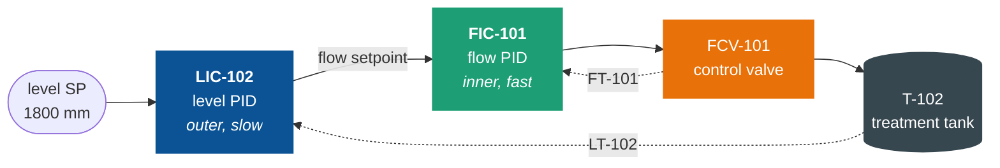
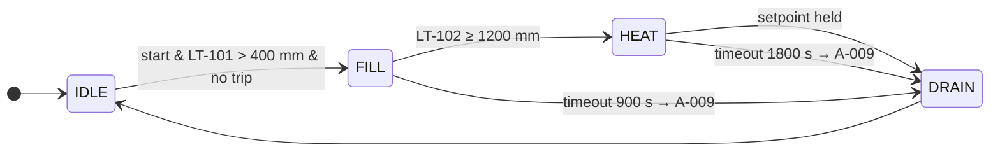

<div align="center">

# `KARISHMA PREMNATH`

### CONTROL SYSTEMS ▸ INDUSTRIAL AUTOMATION ▸ INSTRUMENTATION


[](https://linkedin.com/in/karishma-premnath)
[](mailto:premnath.ka@northeastern.edu)
[](https://doi.org/10.1109/AIDE69088.2026.11545113)

</div>

---

<div align="center">

**I build control systems end to end** — narrative, instrument index, PLC logic,
and a simulated plant to prove it before anything touches hardware.
Instrumentation background, so I think in **tags, ranges and failure directions**
before I think in code.

</div>

---

## ⬢ &nbsp;The control problem I solve

A tank level that must hold steady while the inlet flow fights it. The answer is a
**cascade** — the slow loop sets the target for the fast one:



The inner loop rejects flow disturbances before they ever reach the level. Below it,
eight interlocks can pull permission from any actuator, and none of them are allowed
to depend on the same device that runs the process.

## ⬢ &nbsp;Batch sequence



## ⬢ &nbsp;Selected work

<table>
<tr>
<th align="left" width="220">Project</th>
<th align="left">What it is</th>
</tr>
<tr>
<td valign="top">

**[WTS-100](https://github.com/karishmapremnath4/wts-100-water-treatment-skid)**
`water treatment skid`


</td>
<td valign="top">

A complete PLC control system: control narrative, ISA-5.1 P&ID, instrument index and
signal scaling, IEC 61131-3 Structured Text and ladder, a Modbus TCP plant simulation
with HMI and historian, and a factory acceptance test.

`4 loops` `8 interlocks` `12 alarms` `33 I/O` — **FAT 14/14** and **logic 26/26 passing**.
The safety block also compiles and runs in OpenPLC.

</td>
</tr>
<tr>
<td valign="top">

**[PLC-ML](https://github.com/karishmapremnath4/plc-st-bug-detector-ml)**
`ST defect detection`


</td>
<td valign="top">

Machine learning that finds and repairs logic bugs in Structured Text — dropped
interlocks, wrong setpoints, missing edge detection. The defects that compile cleanly
and fail on the plant.

`300 programs` `8 defect classes` — **81.7% → 100%**, and the gain came from fixing
the *features*, not the model.

</td>
</tr>
<tr>
<td valign="top">

**[Publications](https://github.com/karishmapremnath4/publications)**
`peer-reviewed`


</td>
<td valign="top">

Model predictive control using machine learning models, validated on a laboratory
benchtop temperature control station — real closed-loop control on hardware.

Ridge regression beat the neural network on every error metric: **MSE 0.0058**,
**ITAE 12.2788**, 69% lower MSE at lower computational cost.

</td>
</tr>
</table>

## ⬢ &nbsp;Capability

```
PLC & CONTROL      IEC 61131-3 (Ladder · Structured Text) · CODESYS · OpenPLC
                   PID and loop tuning · cascade · ratio · Model Predictive Control
INTERFACES         SCADA · HMI · Modbus TCP
INSTRUMENTATION    instrument index · I/O list · sensor selection and ranging
                   4-20 mA loop design · signal conditioning · calibration · DAQ
STANDARDS          ISA-5.1 (P&ID) · ISA-18.2 (alarms) · Factory Acceptance Test
LANGUAGES          Python · C · Embedded C · Structured Text · SQL
TOOLS              MATLAB · Simulink · LabVIEW · AutoCAD · Arduino IDE · Multisim
```

---

<div align="center">

**MS Electrical & Computer Engineering** · Northeastern University · GPA 3.834
**BTech Electronics & Instrumentation** · SASTRA Deemed University

`Open to Spring 2027 co-op — controls, automation, instrumentation`

[](https://linkedin.com/in/karishma-premnath)

</div>
